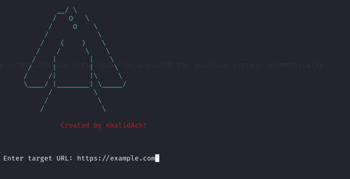

# Scorpich

Introducing a Python-based tool designed for effortless website port scanning. This lightweight yet powerful utility automates the process by simply inputting the target URL. Once initiated, it swiftly conducts comprehensive scans to detect open ports, providing valuable insights into the website's network security.

This tool offers a user-friendly experience, making it accessible for both beginners and seasoned users. By leveraging the URL alone, it seamlessly executes scans, eliminating the need for complex configurations or extensive technical knowledge.

Efficiency is key, and this tool delivers. With its intuitive interface and automated functionality, it streamlines the process of identifying open ports, empowering users to enhance their understanding of website security with ease.

Experience simplicity and effectiveness combined in this Python-based port scanning tool, designed to simplify the task of website security assessment.

## Table of Contents

- [Installation](#installation)
- [Usage](#usage)
- [Dependencies](#dependencies)
- [Contributing](#contributing)
- [License](#license)

## Installation

1. Clone the repository:
   ```sh
   https://github.com/khalidach123/Scorpich.git

2. Navigate to the project directory:
   ```sh
   cd Scorpich

3. Install the required dependencies:
   ```sh
   pip3 install -r requirements.txt

## Usage

Using this tool is straightforward. Simply input the target URL and press Enter to initiate the scanning process automatically.

   ```sh
   python3 scorpich.py

   ```

## Dependencies

Required Python packages

* [nmap](https://nmap.org/)
* [requests](https://requests.readthedocs.io/en/latest/)
* [colorama](https://pypi.org/project/colorama/)

## Contributing

If you would like to contribute to the project, please follow these steps:

    1. Fork the repository.
    2. Create a new branch (git checkout -b feature-branch).
    3. Make your changes.
    4. Commit your changes (git commit -am 'Add new feature').
    5. Push to the branch (git push origin feature-branch).
    6. Create a new Pull Request.

## Licence

Please read the Licence file.


> Thanks <3

## Tags
- #python
- #networking
- #security
- #web
- #scan
- #hacking
- #tool

